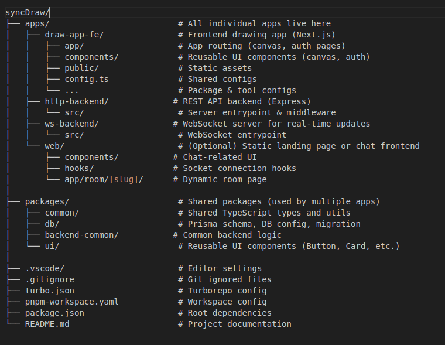

# 🎨 syncDraw – Real-Time Collaborative Drawing App

syncDraw is a real-time collaborative whiteboard application that enables multiple users to draw together in shared rooms. It supports user authentication, dynamic canvas sessions, and live updates via WebSockets — all built on a scalable monorepo architecture.

---

## 🚀 Features

- 🖌️ Real-time collaborative canvas (room-based)
- 🔐 User authentication (Sign in / Sign up)
- 📡 WebSocket-based live drawing sync
- 💬 (WIP) In-room chat functionality
- 🧱 Monorepo setup using TurboRepo + PNPM
- ♻️ Reusable UI and backend packages
- 🧠 Prisma ORM for DB management

---

## ✅ Project Progress

The core structure and functionality of **syncDraw** have been successfully implemented. Below is a summary of the current development status:

- ✅ A scalable **monorepo architecture** has been set up using TurboRepo and PNPM.
- ✅ A **real-time collaborative drawing canvas** has been built with support for rectangles.
- ✅ Basic **user authentication** (Sign in / Sign up) pages are implemented.
- ✅ A dedicated **WebSocket server** enables real-time synchronization across drawing sessions.
- ✅ **Reusable UI components** and shared backend logic are organized into modular packages.
- ✅ **Database integration** is handled via Prisma with initial schema and migrations completed.

---

## 🔄 Planned Enhancements

Development is ongoing, with several exciting features planned for future updates:

- ✏️ Add more drawing tools: **freehand**, **circle**, **line**
- 🧼 Include utilities like **eraser**, **undo/redo**, and **clear canvas**
- 📤 Enable users to **export drawings** as images
- 👥 Show **user presence indicators**, such as live cursors in shared rooms
- 💬 Implement **real-time in-room chat**
- 🖼️ Improve **UI/UX** for accessibility and user interaction

---

### 🧰 Canvas Tools

- ✅ Rectangle tool
- ⏳ Upcoming: Free draw, Eraser, Line, Circle, Diamond

---

## 🧰 Tech Stack

| Layer         | Tech                             |
|--------------|----------------------------------|
| Frontend      | React, Next.js, Tailwind CSS     |
| Backend       | Node.js, Express (HTTP), WebSocket |
| Auth          | Custom auth (email/password)     |
| Database      | PostgreSQL (via Prisma ORM)      |
| Real-time     | WebSocket API                    |
| Dev Tools     | TypeScript, PNPM, TurboRepo      |

---

## 🗂️ Monorepo Structure

